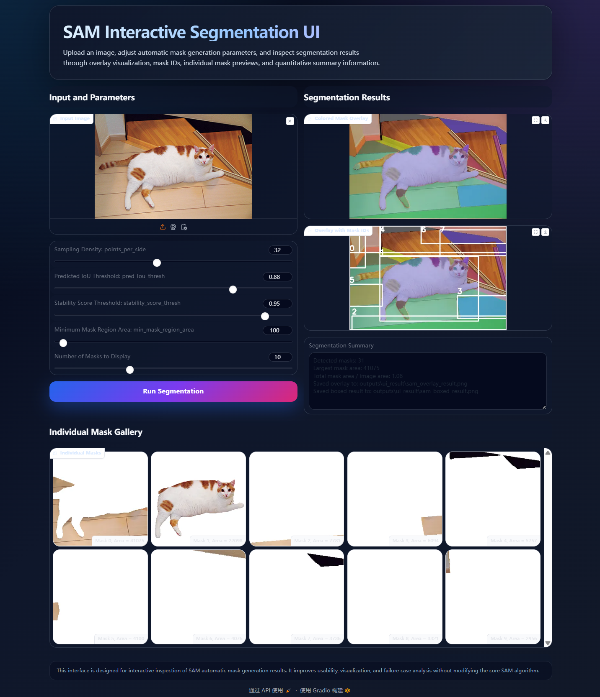

\# SAM Failure Case Analysis and UI Improvement

This project is for the Visual Media assignment.  

It is based on the Segment Anything Model (SAM) and focuses on failure case analysis and practical improvement.

<h2>Demo</h2>

<h3>Original Input Image</h3>


<h3>Improved Web UI</h3>



\## Main Improvements


\- Brightness and contrast preprocessing

\- English web interface

\- Improved UI design

\- Better visualization of SAM segmentation results


\## Failure Cases


The main failure cases observed in this project are:


1\. SAM performs poorly under low-light conditions.

2\. Background seaweed may be incorrectly segmented as one large object.

3\. The original interface is not user-friendly for interactive testing.


\## How to Run


```bash

python app.py --checkpoint checkpoints/sam\_vit\_b\_01ec64.pth --model-type vit\_b --device cpu

